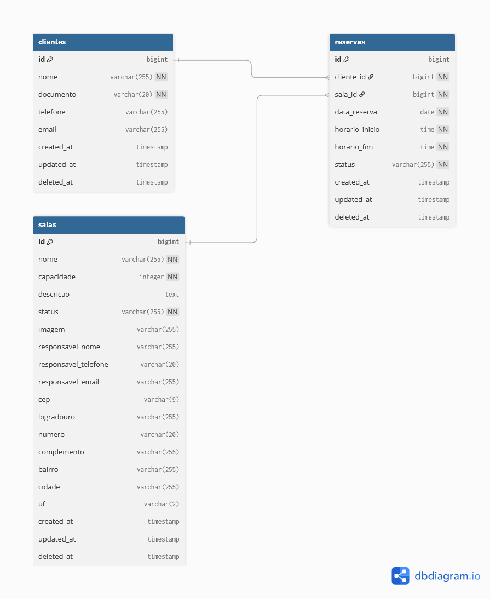
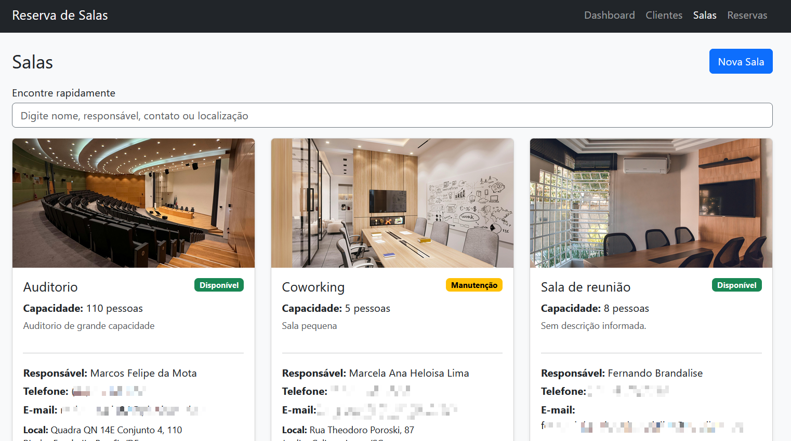
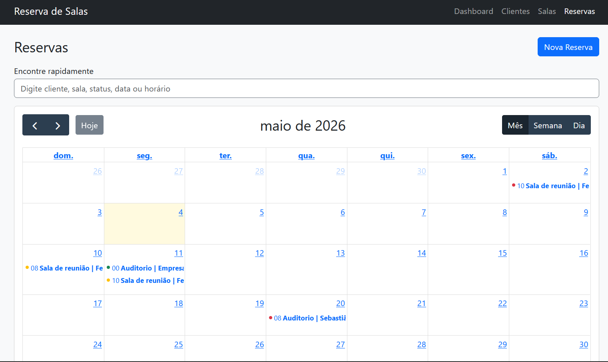

# Salas - Sistema de Reserva de Salas

Aplicacao Laravel para gerenciamento de clientes, salas e reservas.

Trabalho A1/3.
Grupo: Fernando Brandalise, Gabriel Likes , Victor Luckmann

## Requisitos

- Docker Desktop (com Docker Compose)
- Git
- (Opcional) WSL2 no Windows

## Setup e Execucao

### 1. Clonar o projeto

```bash
git clone <url-do-repositorio>
cd salas
```

### 2. Criar arquivo de ambiente

```bash
cp .env.example .env
```

### 3. Subir os containers

```bash
docker compose up -d --build
```

### 4. Instalar dependencias

```bash
docker compose exec app composer install
```

### 5. Gerar chave da aplicacao

```bash
docker compose exec app php artisan key:generate
```

### 6. Executar migrations

```bash
docker compose exec app php artisan migrate
```

### 7. Criar usuario padrao (admin)

```bash
docker compose exec app php artisan db:seed
```

### 8. Criar link do storage publico

```bash
docker compose exec app php artisan storage:link
```

### 9. Acessar no navegador

```text
http://localhost:8080
```

Credenciais padrao da primeira instalacao:

```text
E-mail: admin@salas.com
Senha: 123456
```

## Relacionamentos

- `Cliente` 1:N `Reserva`
  - Um cliente pode possuir varias reservas.
  - Uma reserva pertence a um cliente.
- `Sala` 1:N `Reserva`
  - Uma sala pode possuir varias reservas.
  - Uma reserva pertence a uma sala.



## Regras de Negocio

### Clientes

- Campos principais: `nome`, `documento`, `telefone`, `email`.
- `documento` e obrigatorio e unico (CPF/CNPJ).
- Cliente pode ter varias reservas.

### Salas

- Campos principais: `nome`, `capacidade`, `descricao`, `status`, `imagem`.
- Contato da loja: `responsavel_nome`, `responsavel_telefone`, `responsavel_email`.
- Localizacao: `cep`, `logradouro`, `numero`, `complemento`, `bairro`, `cidade`, `uf`.
- `status` permitido: `disponivel`, `indisponivel`, `manutencao`.
- Upload de imagem opcional:
  - formatos: `jpg`, `jpeg`, `png`, `webp`
  - tamanho maximo: `2MB`
- Atualizacao de imagem remove a imagem antiga do storage.
- Exclusao da sala:
  - bloqueada se houver reservas vinculadas
  - exclusao logica (soft delete)



### Reservas

- Campos principais: `cliente_id`, `sala_id`, `data_reserva`, `horario_inicio`, `horario_fim`, `status`.
- Ao criar nova reserva:
  - status sempre `pendente` automaticamente
  - confirmacao e feita manualmente na edicao
- Validacoes:
  - `horario_fim` deve ser maior que `horario_inicio`
  - cliente e sala devem existir




### Regras de Reserva

1. Um cliente pode ter somente 1 reserva por dia.
2. Um cliente pode ter no maximo 3 reservas por mes.
3. Uma sala nao pode ter conflito de horario no mesmo dia.
4. Reserva so pode ser criada para sala com status `disponivel`.

### Exclusao Logica (Soft Delete)

- Entidades com exclusao logica:
  - `clientes`
  - `salas`
  - `reservas`
- Ao excluir, o registro recebe `deleted_at` e deixa de aparecer no front.

## Recursos de Frontend Implementados

- Dashboard com vitrine de salas.
- Botao "Reservar" no dashboard abre Nova Reserva com sala pre-selecionada.
- Tela de reservas com calendario (mes/semana/dia).
- Busca responsiva nas listagens (filtra ao digitar, sem submit manual):
  - clientes
  - salas
  - reservas
- Mascaras de entrada:
  - CPF/CNPJ e telefone em clientes
  - telefone e CEP em salas
- Integracao ViaCEP para preenchimento automatico de endereco nas salas.

- ## 📑 Checklist de Validação da Entrega (Requisitos A1/3)

Abaixo estão listados os critérios obrigatórios solicitados para a aplicação e como eles foram cobertos no desenvolvimento:

- [x] **Cadastro e login de usuários**
  * *Implementação:* Controlado pelo `AuthController` com views dedicadas para autenticação e sessão segura.
- [x] **Campo ou estrutura para identificar o perfil do usuário**
  * *Implementação:* Adicionada a coluna `perfil` via banco de dados (Migration) e centralizado através da constante `PERFIS = ['admin', 'usuario']` dentro da Model `User`.
- [x] **Pelo menos 2 perfis de acesso**
  * *Implementação:* Definidos e validados os escopos para `admin` (Administrador) e `usuario` (Usuário Comum).
- [x] **Proteção de rotas para impedir acesso não autorizado**
  * *Implementação:* Bloqueio global feito pelo middleware nativo `auth` e restrição da área administrativa feita pelo middleware customizado `EnsureUserIsAdmin`.
- [x] **Menu ou interface adaptada conforme o perfil logado**
  * *Implementação:* Uso de diretivas Blade `@if (auth()->user()?->isAdmin())` para ocultar/exibir links de navegação e botões críticos de mutação (como *Editar* e *Excluir*).
- [x] **Pelo menos 3 regras de autorização obrigatórias**
  * *Regra 1:* Usuários não autenticados não acessam o sistema interno (Middleware `auth`).
  * *Regra 2:* Apenas o perfil administrador pode visualizar e gerenciar a tela de usuários (`/usuarios`).
  * *Regra 3:* Apenas o administrador possui permissão para alterar o `status` de uma reserva (regra aplicada e validada no método `update` do `ReservaController`).
  * *Regra 4:* Apenas administradores podem deletar registros globais da aplicação.
- [x] **Mensagens ou redirecionamentos adequados quando o usuário não tiver permissão**
  * *Implementação:* Uso da função nativa `abort(403, 'Mensagem de erro...')` que renderiza automaticamente a view de erro de permissão negada do Laravel.
- [x] **Atualização do README**
  * *Implementação:* Documentação atualizada contendo instruções detalhadas de setup (Docker), credenciais dos usuários de teste, mapeamento dos perfis existentes e suas respectivas matrizes de permissão.

